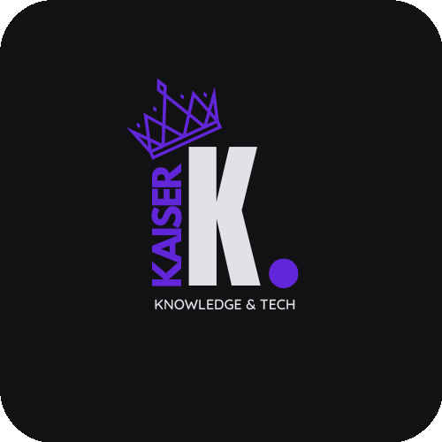

<p align="center">
  
</p>

# KaiserInc Utils

Repositório central de ferramentas, boilerplates e arquivos utilitários usados nos projetos da KaiserInc. A ideia é consolidar num único lugar os padrões arquiteturais, configurações e pontos de partida já validados — eliminando o custo de setup repetitivo a cada novo projeto.

---

## O que tem aqui

### `boilerplates/`

Três boilerplates de API prontos para uso, com os mesmos endpoints, padrões de autenticação e convenções arquiteturais — cada um adaptado idiomaticamente para sua stack.

| Stack | Diretório | Framework | API | Docs | README |
|---|---|---|---|---|---|
| Python | `boilerplates/python-fastapi/` | FastAPI + SQLAlchemy + Alembic | `http://localhost:8000` | `http://localhost:8000/docs` | [README](boilerplates/python-fastapi/README.md) |
| Node.js | `boilerplates/node-fastify/` | Fastify 5 + Drizzle ORM + TypeScript | `http://localhost:3000` | `http://localhost:3000/docs` | [README](boilerplates/node-fastify/README.md) |
| Ruby | `boilerplates/ruby-on-rails/` | Rails 8.1 API-only | `http://localhost:3000` | `http://localhost:3000/scalar` · `http://localhost:3000/api-docs` | [README](boilerplates/ruby-on-rails/README.md) |

Todos implementam:
- **Autenticação dual-token** — access JWT (15min) + refresh token em HTTP-only cookie (7d)
- **Ambiente Docker** com multi-stage build, usuário não-root e PostgreSQL
- **Testes** com cobertura de endpoints e lógica de negócio
- **Documentação OpenAPI** com Scalar UI em `/docs` (Python/Node) ou `/scalar` + Swagger UI em `/api-docs` (Rails)
- **Telemetria** com OpenTelemetry + Jaeger
- **Linting** configurado (ruff / Biome / RuboCop)

---

## Como usar

### Novo projeto a partir de um boilerplate

**Python (FastAPI):**
```bash
cp -r boilerplates/python-fastapi/ ~/KaiserInc/novo-projeto
cd ~/KaiserInc/novo-projeto
cp .env.example .env
docker compose up
# API em http://localhost:8000 | Docs em http://localhost:8000/docs
```

**Node.js (Fastify):**
```bash
cp -r boilerplates/node-fastify/ ~/KaiserInc/novo-projeto
cd ~/KaiserInc/novo-projeto
cp .env.example .env
docker compose up
# API em http://localhost:3000 | Docs em http://localhost:3000/docs
```

**Ruby on Rails:**
```bash
cp -r boilerplates/ruby-on-rails/ ~/KaiserInc/novo-projeto
cd ~/KaiserInc/novo-projeto
cp .env.example .env
docker compose up
# API em http://localhost:3000 | Docs em http://localhost:3000/scalar ou /api-docs
```

### Como usar com Claude Code

Este repositório integra com a skill `/KaiserInc-newProject` do Claude Code, que automatiza a criação de novos projetos a partir dos boilerplates.

A skill suporta três modos:

- **lean** — copia o boilerplate e ajusta configurações básicas (nome, banco, portas)
- **full** — lean + scaffolding do primeiro domínio de negócio (entidade, repositório, service, rota)
- **fullstack-monorepo** — full + frontend React/Next.js integrado no mesmo repositório

```
# Exemplo de uso no Claude Code
/KaiserInc-newProject
```

O Claude irá perguntar qual stack (python / node / rails), qual modo (lean / full / fullstack-monorepo) e o nome do projeto — e configurará tudo automaticamente.

---

## Princípios

**Consistência entre stacks.** Os boilerplates seguem os mesmos contratos de API, mesma estratégia de autenticação e mesma estrutura de endpoints — independente da linguagem. Mudar de stack não muda o contrato.

**Ambiente limpo.** Cada boilerplate tem o mínimo necessário para escalar. Sem dependências desnecessárias, sem código de negócio específico, sem configurações que só fazem sentido para um projeto.

**Prontos para produção.** Multi-stage Docker, usuário não-root, variáveis de ambiente documentadas, migrations automáticas no boot, telemetria integrada.

**Extensíveis.** A estrutura de cada boilerplate foi desenhada para crescer sem refatoração: basta adicionar novos domínios seguindo os padrões já estabelecidos.

---

## Estrutura do repositório

```
KaiserInc-Utils/
├── boilerplates/
│   ├── python-fastapi/     # Clean Architecture + DDD (FastAPI)
│   ├── node-fastify/       # Clean Architecture (Fastify + TypeScript)
│   └── ruby-on-rails/      # Organizers + Interactors (Rails API)
└── README.md               # este arquivo
```

---

## Contribuindo

Ao adicionar um novo boilerplate ou ferramenta:

1. Crie um diretório com nome descritivo da stack/propósito
2. Inclua um `README.md` com stack, arquitetura, comandos e endpoints
3. Garanta que `docker compose up` funcione do zero com `.env.example`
4. Atualize este README com a entrada na tabela de conteúdo
